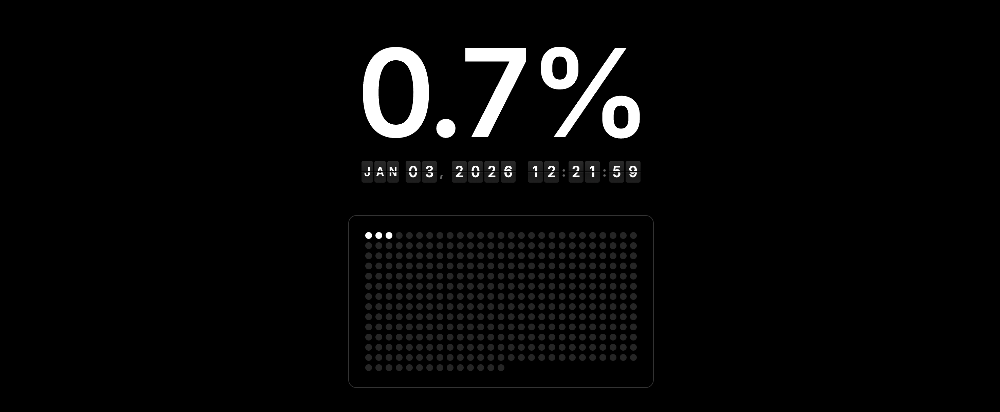

# Year Progress Tracker

A minimalist Chrome extension that transforms your new tab into a powerful year visualization tool. 
- Track your progress through the year with elegant design and real-time updates. 
- Helps you visualize time's passage and stay mindful of your annual progress. 
- Perfect for goal-setters, productivity enthusiasts, and anyone who wants a beautiful, functional new tab experience.

## Key Features

### 🎯 **Real-Time Year Progress Display**
Large, prominent percentage showing exactly how much of the current year has passed, updated in real-time with decimal precision.

### ⏰ **Airport-Style Flip Clock**
Stunning animated flip clock displaying current date and time with smooth transitions that mimic classic airport departure boards. Updates every second with realistic flip animations.

### 📅 **Interactive 365-Day Visual Grid**
Complete year overview displayed as a beautiful grid of circles:
- **Past days**: Solid white circles representing completed days
- **Current day**: Animated pulsing circle with heartbeat effect
- **Future days**: Subtle grey circles for upcoming days
- **Hover tooltips**: Show exact dates when you hover over any day

### 📱 **Fully Responsive Design**
Automatically adapts to different screen sizes with optimized layouts for desktop, tablet, and mobile viewing. Grid adjusts column count and element sizes based on viewport.

### 🎨 **Minimalist Black & White Aesthetic**
Clean, distraction-free design with pure black background and crisp white elements. Typography uses Inter font for maximum readability and modern appeal.

### ⚙️ **Customizable Year Tracking**
Built-in leap year detection and configurable year settings. Default tracks 2026 but can be easily modified to track any year past, present, or future.

## Installation

1. Download and extract this folder

2. Open Chrome and go to:
   ```
   chrome://extensions
   ```

3. Enable **Developer mode** (toggle in top-right corner)

4. Click **Load unpacked**

5. Select the `year-tracker-extension` folder

6. Open a new tab to see your year progress tracker!


## Credits

Design inspired by [Visualize Value](https://visualizevalue.com) (Jack Butcher).


